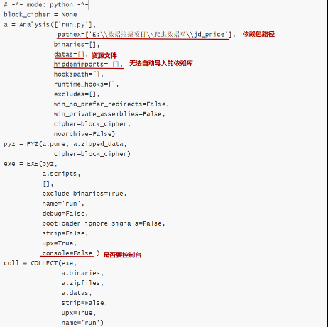

### Pyinstaller

​	将python源代码打包成exe文件

#### 示例

​	首先将依赖库(import)放置在同一目录下，再执行如下命令行语句。执行完后会在同目录下生成xx.spec文件。

```python
-F 代表文件只打包成exe
-c  运行黑框
-D  打包成多个文件
-w 不运行黑框

pyinstaller run.py		# 多个文件+控制台
pyinstaller -F run.py	# 单个文件+控制台
pyinstaller -w run.py	# 多个文件
pyinstaller -F run.py	# 单个文件
```

​	

#### 问题

一般情况下，只打包一次的程序都无法正常运行，需要进一步修改第一步打包生成的配置文件（xx.spec）。


1. 打包成功后，程序无法运行

Pyinstaller由于不能找到动态导入的依赖库的缺陷，因而无法导入某些库，导致程序运行报错。解决的方法是修改配置文件，无法导入的库手动加进去。

```
1. 修改配置文件
2. 执行命令
pyinstaller run.spec
```

配置文件修改示例：

| 问题                         | 解决                                            |
| :--------------------------- | ----------------------------------------------- |
| 程序需要用到图标、配置文件等 | 修改datas = [("原文件路径+文件名","新的路径"),] |
| no modlue name xxx           | hiddenimports = ['无法导入的模块名']            |

配置文件示例



#### 参考

+ [pyinstaller简洁教程](http://legendtkl.com/2015/11/06/pyinstaller/)

+ [Pyinstaller - 规格文件](https://shuhari.dev/blog/2018/06/pyinstaller-specfile)

